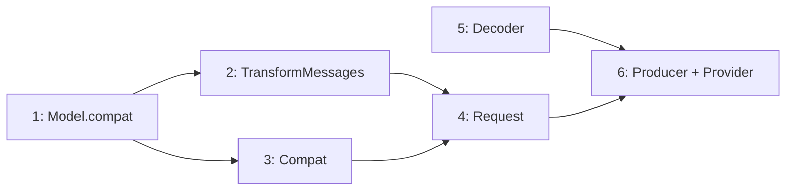

# Port map: OpenAI Completions provider

Porting spec for the `openai-completions` API dialect — the most versatile
provider, covering OpenAI, xAI/Grok, Groq, Cerebras, OpenRouter, Fireworks,
HuggingFace, MiniMax, Kimi/Moonshot, DeepSeek, and more via a single
implementation with a compat knob. Canonical reference: pi-mono v0.69.0
at `tmp/pi-mono/`. All line citations are into that tree.

**Primary sources (read first):**
- `tmp/pi-mono/packages/ai/src/providers/openai-completions.ts` — provider, message/tool conversion, compat detection, stream consumption
- `tmp/pi-mono/packages/ai/src/providers/transform-messages.ts` — cross-provider message normalization
- `tmp/pi-mono/packages/ai/src/providers/simple-options.ts` — reasoning level → provider options mapping
- `tmp/pi-mono/packages/ai/src/types.ts` — `OpenAICompletionsCompat`, `OpenRouterRouting`, `VercelGatewayRouting`
- tests under `tmp/pi-mono/packages/ai/test/openai-completions-*.test.ts`, `transform-messages-*.test.ts`

**Existing Elixir patterns to follow:**
- `apps/octo_pi_ai_anthropic/` — Provider, Producer, Decoder, Request, Application, Auth
- `apps/octo_pi_ai/` — Provider behaviour, ProviderRegistry, Event union, SSE, PartialJson, Model, StreamOptions

---

## 0. What we're building

A new umbrella app `octo_pi_ai_openai` that registers `:openai_completions`
in the ProviderRegistry. `OctoPi.AI.stream(model, context, opts)` dispatches
to it when `model.api == :openai_completions`, returning the same lazy
`Stream` of canonical events as the Anthropic provider.

The upstream uses the `openai` npm SDK as a thin HTTP client — it calls
`client.chat.completions.create()` which returns an async iterator of
`ChatCompletionChunk` objects[^sdk-usage]. We use `Req.post!(into: :self)`
directly (matching the Anthropic producer pattern), parsing the SSE stream
ourselves. The SDK's role is just HTTP + JSON; we already have both.

Also: a shared `TransformMessages` module in `octo_pi_ai` for cross-provider
message normalization (image downgrade, tool-call ID normalization, orphaned
tool-call synthesis, errored-message skipping). Both providers will use it.

---

## 1. Compat layer

Module: **`OctoPi.AI.Providers.OpenAI.Compat`**

The central design element. A resolved compat struct has 16 fields that
control provider-specific behavior differences[^compat-type]. Upstream has
two functions: `detectCompat()` auto-detects defaults from
`model.provider` and `model.baseUrl`[^detect-compat]; `getCompat()` merges
explicit `model.compat` overrides onto the detected defaults[^get-compat].

### 1.1 Compat fields

| Field | Type | Default | Purpose |
|---|---|---|---|
| `supports_store` | boolean | auto | Whether provider accepts `store` param[^supports-store] |
| `supports_developer_role` | boolean | auto | `developer` vs `system` role for system prompt[^dev-role] |
| `supports_reasoning_effort` | boolean | auto | Whether `reasoning_effort` param is accepted[^reasoning-effort] |
| `reasoning_effort_map` | map | `%{}` | Maps pi-ai thinking levels to provider strings[^effort-map] |
| `supports_usage_in_streaming` | boolean | `true` | Whether `stream_options: {include_usage: true}` works[^usage-streaming] |
| `max_tokens_field` | atom | `:max_completion_tokens` | `:max_completion_tokens` vs `:max_tokens`[^max-tokens-field] |
| `requires_tool_result_name` | boolean | `false` | Whether tool results need `name` field[^tool-name] |
| `requires_assistant_after_tool_result` | boolean | `false` | Synthetic assistant message between tool result and user[^synthetic-asst] |
| `requires_thinking_as_text` | boolean | `false` | Convert thinking blocks to plain text[^thinking-text] |
| `thinking_format` | atom | `:openai` | `:openai \| :openrouter \| :zai \| :qwen \| :qwen_chat_template`[^thinking-format] |
| `supports_strict_mode` | boolean | `true` | Whether `strict` is accepted on tool definitions[^strict] |
| `cache_control_format` | atom or nil | `nil` | `nil` or `:anthropic` for Anthropic-style cache markers[^cache-format] |
| `send_session_affinity_headers` | boolean | `false` | Session stickiness headers[^affinity] |
| `zai_tool_stream` | boolean | `false` | z.ai `tool_stream: true` param[^zai] |
| `open_router_routing` | map | `%{}` | OpenRouter provider routing preferences[^or-routing] |
| `vercel_gateway_routing` | map | `%{}` | Vercel AI Gateway routing[^vercel] |

### 1.2 Auto-detection rules

Detection is based on `model.provider` atom and `model.base_url` substring
matching[^detect-compat]:

- **Non-standard providers** (Cerebras, xAI, chutes.ai, DeepSeek, zai,
  OpenCode): `supports_store: false`, `supports_developer_role: false`
- **Grok** (xAI): `supports_reasoning_effort: false`
- **Groq + qwen3-32b**: all reasoning levels map to `"default"`
- **chutes.ai**: uses `:max_tokens` instead of `:max_completion_tokens`
- **zai**: `thinking_format: :zai`, `supports_reasoning_effort: false`
- **OpenRouter**: `thinking_format: :openrouter`; Anthropic-model routes
  get `cache_control_format: :anthropic`

### 1.3 Model.compat field

`OctoPi.AI.Model` needs an optional `:compat` field to carry
provider-specific knobs. Type: `map() | nil`. The compat module reads
`model.compat` and merges non-nil values onto the auto-detected defaults.

---

## 2. HTTP request

Module: **`OctoPi.AI.Providers.OpenAI.Request`**

### 2.1 Endpoint

- `POST {model.base_url}/chat/completions`
- Uses OpenAI's `ChatCompletionCreateParamsStreaming` shape.

### 2.2 Auth

API key only (Phase 1). Source: `opts.api_key` override, then
provider-specific env var (e.g. `OPENAI_API_KEY`). Upstream resolves via
`getEnvApiKey(model.provider)`[^env-key].

### 2.3 Client construction

Upstream creates an `OpenAI` SDK client per call[^create-client]:
- `apiKey`, `baseURL` from model
- `defaultHeaders` from model + session affinity + options overrides
- GitHub Copilot gets dynamic headers based on message content[^copilot]

We construct the equivalent `Req` request with merged headers.

### 2.4 Body shape[^build-params]

```json
{
  "model": "gpt-4o",
  "messages": [...],
  "stream": true,
  "stream_options": { "include_usage": true },
  "max_completion_tokens": 8000,
  "temperature": 0.7,
  "tools": [...],
  "tool_choice": "auto",
  "store": false,
  "prompt_cache_key": "session-id",
  "prompt_cache_retention": "24h",
  "reasoning_effort": "high"
}
```

Conditional fields driven by compat:
- `stream_options` omitted when `supports_usage_in_streaming: false`[^stream-opts]
- `store: false` only when `supports_store: true`[^store]
- `max_tokens` vs `max_completion_tokens` per `max_tokens_field`[^max-tokens]
- `prompt_cache_key`/`prompt_cache_retention` only for `api.openai.com`[^cache-key]

### 2.5 Reasoning/thinking params

Five format variants[^thinking-params]:

| `thinking_format` | Body shape |
|---|---|
| `:openai` | `reasoning_effort: "high"` (when `supports_reasoning_effort`) |
| `:openrouter` | `reasoning: { effort: "high" }` or `reasoning: { effort: "none" }` |
| `:zai` | `enable_thinking: true/false` |
| `:qwen` | `enable_thinking: true/false` |
| `:qwen_chat_template` | `chat_template_kwargs: { enable_thinking: true, preserve_thinking: true }` |

Effort values pass through `reasoning_effort_map` for provider-specific
remapping[^effort-map-usage].

### 2.6 Tool conversion[^convert-tools]

```json
{
  "type": "function",
  "function": {
    "name": "read",
    "description": "Read a file",
    "parameters": { ... },
    "strict": false
  }
}
```

- `strict` included only when `supports_strict_mode: true`
- Empty `tools: []` sent when no tools but message history contains
  tool_calls/tool_results (required by Anthropic via LiteLLM proxy)[^tool-history]
- `tool_stream: true` added at top level for zai[^zai-tool-stream]

### 2.7 Cache control (Anthropic format)

When `cache_control_format: :anthropic`[^cache-control]:
- System/developer message: last text part gets `cache_control: {type: "ephemeral"}`
- Last tool definition gets `cache_control: {type: "ephemeral"}`
- Last user/assistant message: last text part gets `cache_control`
- TTL `"1h"` only for `api.anthropic.com` hosts with long retention

---

## 3. Message conversion

Part of **`OctoPi.AI.Providers.OpenAI.Request`**.

### 3.1 System prompt

Inline as first message, not a separate field[^system-msg]:
- Reasoning models + `supports_developer_role`: `role: "developer"`
- Otherwise: `role: "system"`
- Text sanitized via surrogate removal

### 3.2 User messages[^user-msg]

- String content → `role: "user", content: "text"`
- Block content → array of `{type: "text"}` and `{type: "image_url",
  image_url: {url: "data:mime;base64,..."}}` parts
- Empty content arrays skipped

### 3.3 Assistant messages[^asst-msg]

**Critical:** content must be plain string, not array of text blocks.
Array format causes DeepSeek V3.2/NIM to mirror the structure literally
in output[^string-not-array].

- Text blocks → concatenated into single string
- Thinking blocks (non-empty):
  - `requires_thinking_as_text: true` → convert to plain text, prepend
    before text parts as content array[^thinking-as-text]
  - Otherwise → keep as string content; store thinking in the field named
    by `thinkingSignature` (e.g. `reasoning_content`)[^thinking-sig]
- Tool calls → `tool_calls: [{id, type: "function", function: {name, arguments: JSON}}]`
- Reasoning details (encrypted) → `reasoning_details` array[^reasoning-details]
- Empty messages (no content, no tool_calls) skipped[^skip-empty]

### 3.4 Tool result messages[^tool-result]

- `role: "tool"`, `tool_call_id`, `content: "text"`
- Images extracted from tool results → sent as follow-up `role: "user"`
  message with `{type: "image_url"}` parts (only for vision models)[^tool-images]
- Consecutive tool results batched; images collected across the batch
- `name` field included only when `requires_tool_result_name: true`[^tool-result-name]
- Synthetic `role: "assistant", content: "I have processed the tool results."`
  inserted when `requires_assistant_after_tool_result: true`[^synthetic-bridge]

### 3.5 Tool call ID normalization[^normalize-id]

- Pipe-separated IDs (from OpenAI Responses API): extract `call_id` before
  `|`, sanitize to `[a-zA-Z0-9_-]`, truncate to 40 chars
- OpenAI provider: truncate to 40 chars
- Others: pass through

---

## 4. Stream decoding

Module: **`OctoPi.AI.Providers.OpenAI.Decoder`**

Upstream doesn't have a separate decoder — stream consumption is inline in
the `streamOpenAICompletions` function[^stream-loop]. We extract it into a
pure state machine matching the Anthropic decoder pattern: `new/1`,
`handle/2`, `finalize/1`, `error/3`.

### 4.1 State

```elixir
%State{
  model: Model.t(),
  message: Message.Assistant.t(),     # content in reverse order (O(1) head updates)
  content_count: non_neg_integer(),   # forward-order count
  current_block: :text | :thinking | {:tool_call, stream_index} | nil,
  partial_args: %{non_neg_integer() => binary()},  # per-tool-call JSON accumulator
  reasoning_field: String.t() | nil   # which delta field is carrying reasoning
}
```

### 4.2 Chunk handling

Each `ChatCompletionChunk` carries `choices[0].delta` with several optional
fields. Unlike Anthropic's typed event protocol, everything arrives on the
same delta object[^flat-delta]. Processing order within a single chunk:

1. **`response_id`**: `output.responseId ||= chunk.id`[^response-id]

2. **Usage**: `chunk.usage` (standard) or `choice.usage` (Moonshot
   fallback)[^usage-fallback]. Fields:
   - `prompt_tokens`, `completion_tokens`
   - `prompt_tokens_details.cached_tokens`, `.cache_write_tokens`
   - `completion_tokens_details.reasoning_tokens`
   - Cache read normalization: when `cache_write > 0`, subtract
     `cache_write` from reported `cached_tokens` (OpenRouter reports sum
     of previous hits + current writes)[^cache-normalize]
   - Cost computed from model pricing

3. **Finish reason**: mapped via `mapStopReason`[^stop-reason]:

   | OpenAI | Canonical |
   |---|---|
   | `stop`, `end` | `:stop` |
   | `length` | `:length` |
   | `function_call`, `tool_calls` | `:tool_use` |
   | `content_filter` | `:error` ("content_filter") |
   | `network_error` | `:error` ("network_error") |
   | anything else | `:error` |

4. **Text** (`delta.content`)[^text-delta]: if non-null and non-empty,
   open a new text block if needed (finishing any prior block), accumulate
   text, emit `text_start` / `text_delta`.

5. **Reasoning** (`delta.reasoning_content` / `delta.reasoning` /
   `delta.reasoning_text`)[^reasoning-delta]: check three fields in
   priority order, use first non-empty. Same block lifecycle as text but
   emits `thinking_start` / `thinking_delta`. The field name is stored
   as `thinkingSignature` for replay.

6. **Tool calls** (`delta.tool_calls[]`)[^tool-calls]: array of partial
   tool call deltas, each with optional `index`, `id`, `function.name`,
   `function.arguments`. Multiplexed by `index` (or `id` fallback).
   - New tool call (different index or id) → finish prior block, open new
     `ToolCall`, emit `toolcall_start`
   - Same tool call → accumulate `id`, `name`, `arguments` as they arrive
   - Arguments parsed incrementally via `PartialJson.parse_streaming/1`
   - On block finish: final parse, delete `partial_args` and `stream_index`
     scratch fields, emit `toolcall_end`

7. **Reasoning details** (`delta.reasoning_details[]`)[^reasoning-details-stream]:
   type `"reasoning.encrypted"` entries matched to tool calls by `id`,
   stored as `thought_signature` (JSON-encoded).

### 4.3 Block lifecycle

Upstream tracks a single `currentBlock` pointer and calls
`finishCurrentBlock()` when switching between content types[^finish-block].
Our decoder mirrors this: each new text/thinking/toolcall block finishes
the previous one. `finalize/1` finishes the last open block and emits
`Event.Done` or `Event.Error` based on stop reason.

### 4.4 Error handling[^error-handling]

On exception in the stream loop:
- Delete scratch fields (`partialArgs`, `streamIndex`) from all blocks
- Set `stop_reason` to `:aborted` (if signal aborted) or `:error`
- Set `error_message` from exception
- Append OpenRouter `error.metadata.raw` if present
- Emit `Event.Error`, end stream

---

## 5. TransformMessages (shared)

Module: **`OctoPi.AI.TransformMessages`** (in `octo_pi_ai`)

Cross-provider message normalization, ported from
`transform-messages.ts`[^transform]. Both the Anthropic and OpenAI providers
will use this before converting messages to their wire format.

### 5.1 Image downgrade[^image-downgrade]

For models without `:image` in `model.input`:
- User message image blocks → placeholder text `"(image omitted: model
  does not support images)"`
- Tool result image blocks → `"(tool image omitted: model does not
  support images)"`
- Consecutive image blocks collapse to a single placeholder

### 5.2 Assistant message transformation[^asst-transform]

For cross-model messages (`assistantMsg.provider != model.provider` or
different `api`/`model`):
- Redacted thinking blocks → dropped (encrypted, model-specific)
- Thinking blocks with signatures → kept only for same model
- Empty thinking blocks → dropped
- Non-empty thinking blocks → converted to `Content.Text`
- `thought_signature` on tool calls → stripped
- Tool call IDs → renormalized via provider callback

For same-model messages: preserved as-is (signatures valid for replay).

### 5.3 Orphaned tool call synthesis[^orphaned]

After transformation, scan for assistant messages with tool calls that
have no corresponding tool result in the following messages. Insert
synthetic `ToolResult` messages with `content: "No result provided"`,
`is_error: true`. This satisfies API requirements that every tool call
must have a result.

### 5.4 Errored message skipping[^errored-skip]

Assistant messages with `stop_reason in [:error, :aborted]` are dropped
entirely — incomplete turns shouldn't be replayed. They may have partial
content (reasoning without message, incomplete tool calls) that causes
API errors.

### 5.5 Tests to port

`transform-messages-copilot-openai-to-anthropic.test.ts`[^transform-test]
is a pure unit test exercising tool-call ID normalization, thinking block
transformation, and orphaned tool call synthesis across Copilot → Anthropic
handoffs.

---

## 6. Producer + Provider + Application

Modules:
- **`OctoPi.AI.Providers.OpenAI.Producer`** — supervised Task
- **`OctoPi.AI.Providers.OpenAI`** — `@behaviour OctoPi.AI.Provider`
- **`OctoPi.AI.Providers.OpenAI.Application`** — registry + supervision

### 6.1 Producer

Same architecture as the Anthropic producer[^anthropic-producer]:

1. Emit `Event.Start` immediately
2. `Req.post!(into: :self)` with merged headers
3. Drain chunks via `Req.parse_message/2`
4. SSE decode → JSON parse → `Decoder.handle/2` → emit canonical events
5. Flush trailing SSE on connection close
6. Emit terminal `Event.Done` or `Event.Error`
7. Send `:done` sentinel

Lifecycle: caller death → monitor fires → aborted. HTTP errors → error
event. Exceptions caught → error event + telemetry.

### 6.2 SSE format difference

OpenAI's SSE stream sends `data: [DONE]` as the terminal event instead
of structured JSON[^openai-done]. The producer must handle this:
- `data: [DONE]` → skip (not valid JSON), let the HTTP body end naturally
- All other `data:` lines → JSON parse → decoder

### 6.3 Provider

Identical pattern to `OctoPi.AI.Providers.Anthropic`[^anthropic-provider]:

```elixir
@behaviour OctoPi.AI.Provider

def stream(model, context, opts) do
  # spawn Producer, return Stream.resource/3
end

def stream_simple(model, context, opts) do
  # resolve reasoning → reasoning_effort via compat
  # delegate to stream/3
end
```

`stream_simple/3` is where the `SimpleStreamOptions` → provider options
mapping happens[^stream-simple]: clamp reasoning level (xhigh only for
models that support it), resolve `reasoning_effort` via compat map,
pass `tool_choice` through.

### 6.4 Application

```elixir
def start(_type, _args) do
  ProviderRegistry.register(:openai_completions, OctoPi.AI.Providers.OpenAI)
  OpenAIHandler.attach()  # telemetry

  children = [
    {Task.Supervisor, name: OctoPi.AI.Providers.OpenAI.TaskSup}
  ]

  Supervisor.start_link(children, strategy: :one_for_one, name: __MODULE__)
end
```

---

## 7. Upstream tests to port

### 7.1 Unit tests (mock-based, port directly)

These use vitest mocks of the OpenAI SDK to test request building and
param shaping without hitting any API:

| Upstream test file | Tests | Elixir target |
|---|---|---|
| `openai-completions-cache-control-format.test.ts`[^test-cache] | Anthropic-style cache_control markers on messages/tools | `Request` |
| `openai-completions-thinking-as-text.test.ts`[^test-thinking] | `requiresThinkingAsText` conversion + SSE stream with reasoning | `Request` + `Decoder` |
| `openai-completions-tool-choice.test.ts`[^test-toolchoice] | tool_choice passthrough + reasoning_effort | `Request` |
| `openai-completions-tool-result-images.test.ts`[^test-images] | Image extraction from tool results → follow-up user message | `Request` |
| `openai-completions-prompt-cache.test.ts`[^test-cache-key] | prompt_cache_key / prompt_cache_retention params | `Request` |
| `transform-messages-copilot-openai-to-anthropic.test.ts`[^test-transform] | Cross-provider tool-call ID norm, thinking block transform | `TransformMessages` |

### 7.2 Decoder tests (write new)

Upstream tests the decoder inline via mock SDK streams. We extract into
dedicated `Decoder` unit tests covering:

- Text-only stream → `text_start/delta/end` + `done`
- Reasoning stream (all three field variants)
- Tool call with index-based multiplexing
- Multiple tool calls in one response
- Mixed text + tool calls
- Usage parsing (standard + Moonshot fallback)
- Cache token normalization (OpenRouter double-count)
- Stop reason mapping (all variants)
- Empty stream (immediate finish_reason)
- Reasoning details → thought_signature on tool calls

### 7.3 Integration tests (defer)

These hit real APIs and need credentials. Defer to a later phase:

- `stream.test.ts`, `tokens.test.ts`, `total-tokens.test.ts` — multi-provider
- `abort.test.ts`, `empty.test.ts`, `responseid.test.ts` — multi-provider
- `cross-provider-handoff.test.ts` — needs multiple provider credentials
- `tool-call-id-normalization.test.ts` — needs Copilot/Codex tokens
- `tool-call-without-result.test.ts` — multi-provider

### 7.4 Producer integration tests (Plug-based)

Match the Anthropic producer's test pattern: Plug-based fake HTTP server
returning canned SSE, verifying the full pipeline from HTTP to canonical
events.

---

## 8. Deferred to later phases

- **GitHub Copilot headers** — dynamic headers based on message
  content[^copilot-defer]
- **OpenRouter routing** — `provider` field in request body for provider
  selection[^or-routing-defer]
- **Vercel AI Gateway routing** — `providerOptions` field[^vercel-defer]
- **Session affinity headers** — `session_id`, `x-client-request-id`,
  `x-session-affinity`[^affinity-defer]
- **Prompt caching** — `prompt_cache_key` / `prompt_cache_retention`
  (OpenAI-specific)[^cache-defer]
- **Cache control** (Anthropic format via OpenRouter) — defer until we
  actually use OpenRouter[^cache-control-defer]
- **Surrogate sanitization** — `sanitizeSurrogates()` strips invalid
  Unicode surrogate pairs from user content[^surrogates]. Low priority;
  Elixir strings are UTF-8 by default.
- **`onPayload` / `onResponse` callbacks** — pre-request and post-response
  hooks[^hooks-defer]
- **Live API integration tests** — need provider credentials

---

## 9. Proposed module layout

```
apps/octo_pi_ai/lib/octo_pi/ai/
├── transform_messages.ex        # § 5  shared cross-provider normalization
└── model.ex                     # add optional :compat field

apps/octo_pi_ai_openai/
├── mix.exs
├── lib/octo_pi/ai/providers/openai/
│   ├── application.ex           # § 6.4  registry + supervision
│   ├── compat.ex                # § 1    16-field compat struct + detection
│   ├── decoder.ex               # § 4    ChatCompletionChunk → canonical events
│   ├── request.ex               # § 2-3  build params + convert messages/tools
│   └── producer.ex              # § 6.1  supervised Task, Req streaming
├── lib/octo_pi/ai/providers/openai.ex  # § 6.3  Provider behaviour impl
└── test/
    ├── support/
    │   └── fake_openai_plug.ex  # Plug-based fake for producer tests
    ├── compat_test.exs          # § 1.2 detection + merge
    ├── decoder_test.exs         # § 4   all event types
    ├── request_test.exs         # § 2-3 message/tool conversion + params
    └── producer_test.exs        # § 6   Plug-based integration

apps/octo_pi_ai/test/
└── transform_messages_test.exs  # § 5   cross-provider normalization
```

---

## 10. Task breakdown

| # | Task | Depends on | Scope |
|---|---|---|---|
| 1 | Model.compat field | — | Add optional `:compat` to `OctoPi.AI.Model`. Tiny. |
| 2 | TransformMessages (shared) | 1 | Port `transform-messages.ts` to `octo_pi_ai`. TDD from upstream test. |
| 3 | Compat | 1 | Struct + `detect/1` + `resolve/2`. TDD from `detectCompat()`/`getCompat()`. |
| 4 | Request | 2, 3 | Message/tool conversion + param building. TDD from 5 upstream test files. |
| 5 | Decoder | — | Pure state machine. TDD from scratch (upstream tests are inline). |
| 6 | Producer + Provider + Application | 4, 5 | HTTP + SSE + wiring. Plug-based integration tests. |



---

## Footnotes

[^sdk-usage]: openai-completions.ts L147-149
[^compat-type]: types.ts L266-299
[^detect-compat]: openai-completions.ts L1004-1059
[^get-compat]: openai-completions.ts L1065-1088
[^supports-store]: openai-completions.ts L483-485
[^dev-role]: openai-completions.ts L708-709
[^reasoning-effort]: openai-completions.ts L536-538
[^effort-map]: openai-completions.ts L560-565, L1027-1036
[^effort-map-usage]: openai-completions.ts L536-538
[^usage-streaming]: openai-completions.ts L479-481
[^max-tokens-field]: openai-completions.ts L487-492
[^tool-name]: openai-completions.ts L869
[^synthetic-asst]: openai-completions.ts L719-723
[^thinking-text]: openai-completions.ts L777-782
[^thinking-format]: openai-completions.ts L517-539
[^strict]: openai-completions.ts L930
[^cache-format]: openai-completions.ts L567-578, L1025
[^affinity]: openai-completions.ts L441-445
[^zai]: openai-completions.ts L501-503
[^or-routing]: openai-completions.ts L542-544
[^vercel]: openai-completions.ts L547-555
[^env-key]: env-api-keys.ts
[^create-client]: openai-completions.ts L414-458
[^copilot]: openai-completions.ts L433-439
[^build-params]: openai-completions.ts L460-558
[^stream-opts]: openai-completions.ts L479-481
[^store]: openai-completions.ts L483-485
[^max-tokens]: openai-completions.ts L487-492
[^cache-key]: openai-completions.ts L475-477
[^thinking-params]: openai-completions.ts L517-539
[^convert-tools]: openai-completions.ts L919-933
[^tool-history]: openai-completions.ts L46-58, L504-507
[^zai-tool-stream]: openai-completions.ts L501-503
[^cache-control]: openai-completions.ts L580-681
[^system-msg]: openai-completions.ts L707-710
[^user-msg]: openai-completions.ts L727-751
[^asst-msg]: openai-completions.ts L754-844
[^string-not-array]: openai-completions.ts L786-793
[^thinking-as-text]: openai-completions.ts L777-782
[^thinking-sig]: openai-completions.ts L795-797
[^reasoning-details]: openai-completions.ts L818-830
[^skip-empty]: openai-completions.ts L836-843
[^tool-result]: openai-completions.ts L845-911
[^tool-images]: openai-completions.ts L846-905
[^tool-result-name]: openai-completions.ts L869
[^synthetic-bridge]: openai-completions.ts L719-723, L889-895
[^normalize-id]: openai-completions.ts L690-703
[^stream-loop]: openai-completions.ts L198-391
[^flat-delta]: openai-completions.ts L225-356
[^response-id]: openai-completions.ts L203
[^usage-fallback]: openai-completions.ts L211-214
[^cache-normalize]: openai-completions.ts L950-955
[^stop-reason]: openai-completions.ts L973-997
[^text-delta]: openai-completions.ts L226-247
[^reasoning-delta]: openai-completions.ts L252-290
[^tool-calls]: openai-completions.ts L292-339
[^reasoning-details-stream]: openai-completions.ts L343-356
[^finish-block]: openai-completions.ts L162-196
[^error-handling]: openai-completions.ts L373-387
[^transform]: transform-messages.ts L64-220
[^image-downgrade]: transform-messages.ts L35-57
[^asst-transform]: transform-messages.ts L90-151
[^orphaned]: transform-messages.ts L155-217
[^errored-skip]: transform-messages.ts L189-194
[^transform-test]: test/transform-messages-copilot-openai-to-anthropic.test.ts
[^anthropic-producer]: apps/octo_pi_ai_anthropic/lib/octo_pi/ai/providers/anthropic/producer.ex
[^anthropic-provider]: apps/octo_pi_ai_anthropic/lib/octo_pi/ai/providers/anthropic.ex
[^openai-done]: OpenAI SSE convention — `data: [DONE]` terminates the stream
[^stream-simple]: openai-completions.ts L393-412, simple-options.ts L3-17
[^test-cache]: test/openai-completions-cache-control-format.test.ts
[^test-thinking]: test/openai-completions-thinking-as-text.test.ts
[^test-toolchoice]: test/openai-completions-tool-choice.test.ts
[^test-images]: test/openai-completions-tool-result-images.test.ts
[^test-cache-key]: test/openai-completions-prompt-cache.test.ts
[^test-transform]: test/transform-messages-copilot-openai-to-anthropic.test.ts
[^copilot-defer]: openai-completions.ts L433-439
[^or-routing-defer]: openai-completions.ts L542-544
[^vercel-defer]: openai-completions.ts L547-555
[^affinity-defer]: openai-completions.ts L441-445
[^cache-defer]: openai-completions.ts L475-477
[^cache-control-defer]: openai-completions.ts L580-681
[^surrogates]: openai-completions.ts L730, sanitize-unicode.ts
[^hooks-defer]: openai-completions.ts L143-150
